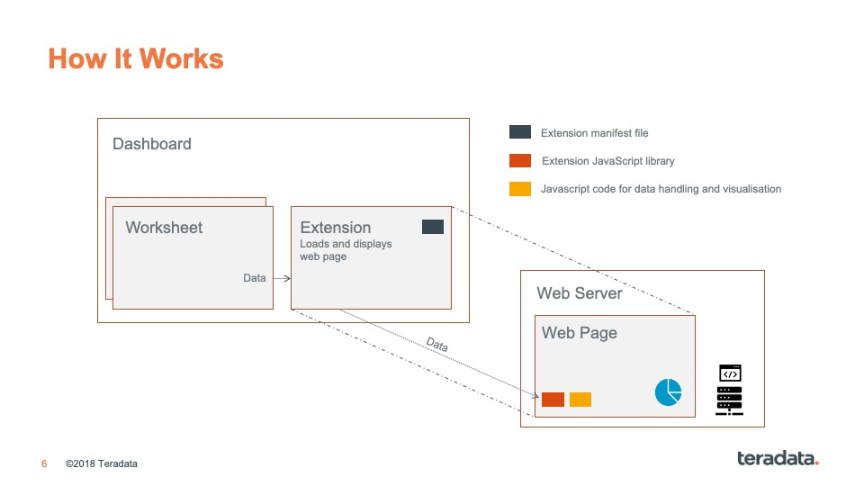

# Tableau Extensions Server With Vue


A custom Tableau Extensions API implementation with Vue, and Vuetify. This implementation is designed for developers to easily add new visualisation templates using different libraries. This is a small personal project during bench time in Teradata.

With Vue, you'll get easy-to-code, blazing fast reactivity. Vue also supports routing, so we can host different custom visualisations in one web application/code base by routing the extension request to different URLs. With Vuetify, you'll find it easy to create reactive visualisation with responsive or fluid layout. Vuetify also comes with lots of prebuilt Material Design components and animations which I like.

There are 3 visualisation libraries readily available in this repo, namely `echarts` (using `vue-echarts`), `google charts` and an open source sunburst charts. The libraries should provide diverse set of possible visualisations. However, should you want to add your own visualisation library, you can do so by installing a new one. 

See [here](https://madewithvuejs.com/blog/top-vue-js-chart-components) to see popular Vue chart libraries.


## Overview

Before continuing, if you don't know how Tableau Extensions API works, here is a picture that illustrates and overly-simplifies it:



See more details on [Tableau Extensions API Github site](https://tableau.github.io/extensions-api/).

Currently, there is 1 visualisation set up:

* Sunburst - Path: Accepts Path `[from, here, to there]` and the Count.

## Adding New Visualisations

To add new visualisations, what you'll work on is the one on the Web Server side, and you'll also need to create a manifest file. Here is a picture of the tasks.


First, you will need to define your component manifest file. The file is stored under `/public/manifests`.

Then you'll need to configure a Vue route in `/src/router/index.js`. See the source file and read [Vue's Router guide](https://router.vuejs.org/guide/#javascript) to learn how you can do that.

Next, create a Vue component to parse the data and display it in your selected visualisation library under `/src/modules`. There are some visualisations that you can use as examples.

## Project setup
```
npm install
```

### Compiles and hot-reloads for development
```
npm run serve
```

### Compiles and minifies for production
```
npm run build
```

### Run your unit tests
```
npm run test:unit
```

### Lints and fixes files
```
npm run lint
```

### Customize configuration
See [Configuration Reference](https://cli.vuejs.org/config/).
